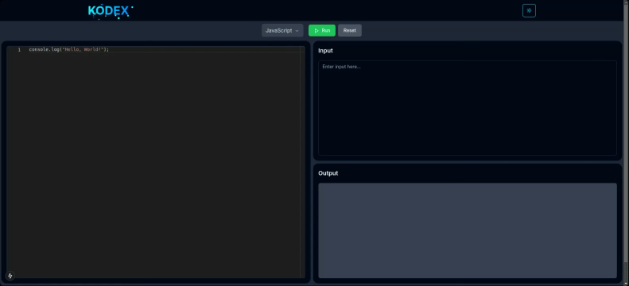

# Kodex

**Kodex** is a web-based code execution platform designed to provide real-time code editing, execution, and terminal-like interactivity across multiple programming languages. This monorepo hosts both the frontend (Next.js) and backend (Express.js + Docker) components.

## Demo

Check out the demonstration of the **Kodex Server** in action:



## 📂 Project Structure

```
Kodex/
├── client/         # Frontend (Next.js)
├── server/         # Backend (Express.js + Docker)
├── .husky/         # Git hooks (precommit, commit-msg, etc.)
├── .github/        # GitHub Actions CI/CD workflows
├── commitlint.config.js
├── README.md       # This file
└── ...
```

> Each app (`client/` and `server/`) has its own README for detailed documentation.

## 🧰 Tech Stack

### Frontend (`client/`)
- [Next.js](https://nextjs.org/)
- TailwindCSS
- ESLint + Prettier
- Husky + lint-staged (Pre-commit hooks)

### Backend (`server/`)
- [Express.js](https://expressjs.com/)
- Docker (dynamic container-based code execution)
- Prisma (ORM)
- Supertest (for integration testing)

## 🚀 Local Development

1. Clone the repository:
   ```bash
   git clone <repo-url>
   cd Kodex
   ```

2. Install dependencies:
   - Frontend:
     ```bash
     cd client && pnpm install
     ```
   - Backend:
     ```bash
     cd server && pnpm install
     ```

3. Set up Git hooks:
   ```bash
   pnpm run prepare
   ```

4. Start development servers:
   - Frontend: `pnpm dev` in `client/`
   - Backend: `pnpm dev` in `server/`

## 🧪 Testing Strategy

- **Unit tests**: Run locally during development
- **Integration tests**: Run on every pull request (via GitHub Actions)
- **End-to-end tests**: Run on every merge (CI/CD)

## 🤖 Git Workflow

We enforce [Conventional Commits](https://www.conventionalcommits.org/en/v1.0.0/) using `commitlint`.

### Examples:
```
feat(client): add code editor UI
fix(server): handle null input in Docker exec
chore: update dependencies
```

> Commits that don't follow this format will be blocked by the preconfigured `commit-msg` Git hook.

## 🧹 Code Style & Linting

- ESLint and Prettier are configured per app.
- Pre-commit hook using `lint-staged` only lints staged files.
- To lint manually:
  ```bash
  pnpm lint
  ```

## 🔀 CI/CD

- GitHub Actions:
  - Runs tests, linting, and commit message checks on PRs
- Independent deployments for `client` (e.g., Vercel/Railway) and `server` (e.g., AWS)

## 📁 Related Documentation

- [Frontend Documentation](client/README.md)
- [Backend Documentation](server/README.md)

## 🧑‍💻 Contributing

Coming soon! For now, feel free to fork, clone, and explore.

## 📄 License

MIT © [Virag Jain](mailto:viragjain3010@gmail.com)