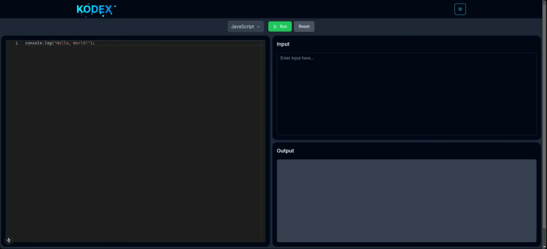

# Kodex

**Kodex** is a web-based code execution platform designed to provide real-time code editing, execution, and terminal-like interactivity across multiple programming languages. This monorepo hosts both the frontend (Next.js) and backend (Express.js + Docker) components.

## Demo

Check out the demonstration of the **Kodex** in action:



> **Note**: The frontend of Kodex is deployed and accessible online here. The backend, which handles secure code execution using Docker containers, is not deployed publicly due to the lack of free hosting platforms that support Docker Compose. For a complete demonstration, including backend functionalities, please refer to the demo video or run the application locally as per the instructions below.

## Features

## 📂 Project Structure

```
Kodex/
├── client/         # Frontend (Next.js)
├── server/         # Backend (Express.js + Docker)
├── .husky/         # Git hooks (precommit, commit-msg, etc.)
├── .github/        # GitHub Actions CI/CD workflows
└── ...
```

> Each app (`client/` and `server/`) has its own README for detailed documentation.

## 🧰 Tech Stack

### Frontend (`client/`)

- Next.js
- TailwindCSS
- Jest + React Testing Library
- ESLint + Prettier
- Husky + lint-staged (Pre-commit hooks)

### Backend (`server/`)

- Express.js
- Docker
- Prisma (ORM)
- Vitest + Supertest

## 🤖 Git Workflow

We enforce [Conventional Commits](https://www.conventionalcommits.org/en/v1.0.0/) using `commitlint`.

### Examples:

```
feat(client): add code editor UI
fix(server): handle null input in Docker exec
chore: update dependencies
```

> Commits that don't follow this format will be blocked by the preconfigured `commit-msg` Git hook.

## 🧹 Code Style & Linting

- ESLint and Prettier are configured per app.
- Pre-commit hook using `lint-staged` only lints staged files.
- To lint manually:
  ```bash
  pnpm lint
  ```

## 🔀 CI/CD

- GitHub Actions:
  - Runs tests, linting, and commit message checks on PRs

## 📁 Related Documentation

- [Frontend Documentation](client/README.md)
- [Backend Documentation](server/README.md)

## 🧑‍💻 Contributing

Coming soon! For now, feel free to fork, clone, and explore.

## 📄 License

MIT © [Virag Jain](mailto:viragjain3010@gmail.com)
